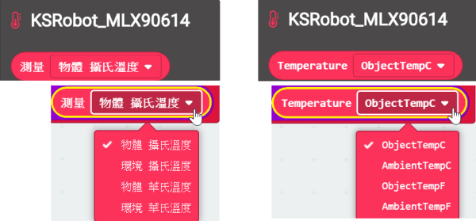

# KAISE KSRobot MLX90614 Infrared Thermometer
- . GND => GND
- . VCC => 3V
- . SDA => P20
- . SCL => P19

## User Guide 

## Code Example 

## License

MIT

## Supported targets

* for PXT/microbit
(The metadata above is needed for package search.)

